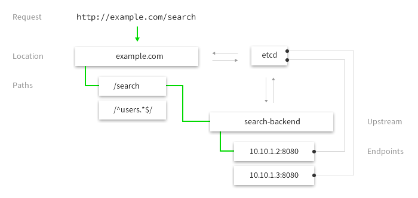

.. _proxy:

User Manual
===========

Glossary
--------

Familiarizing with the glossary would help to understand the rest of this guide.

Host
~~~~

Incoming requests are matched by their hostname first. Hostname is defined by incoming ``Host`` header.
E.g. ``curl http://example.com/alice`` will be matched by the host ``example.com`` first.

Listener
~~~~~~~~
Listener is a dynamic socket that can be attached or detached to host without restart. Host can have multiple http and https listeners 
attached to it, providing service on multiple interfaces and protocols.

Location
~~~~~~~~
Hosts contain one or several locations. Each location defines a path - simply a regular expression that will be matched against request's url.
Location contains link to an upstream and vulcand will use the endpoints from this upstream to serve the request.

   Location ``loc1`` will serve the request ``curl http://example.com/search`` because it matches the path ``/search`` and host ``example.com``

Upstream
~~~~~~~~
Upstream is a collection of endpoints. Upstream can be assigned to multiple locations at the same time. 
This is convenient as sometimes one endpoint serves multiple purposes and locations.

Endpoint
~~~~~~~~
Endpoint is a final destination of the incoming request, each endpoint is defined by ``<schema>://<host>:<port>``, e.g. ``http://localhost:5000``

Middleware
~~~~~~~~~~

Vulcand supports pluggable middlewares. Middlewares can intercept or transform the request to any location. Examples of the supported middlewares are rate limits and connection limits.
You can add or remove middlewares using command line, API or directly via backends.

Secret storage
~~~~~~~~~~~~~~

Vulcand supports secret storage - running process acts like encryption/decryption service every time it reads and writes sensitive data, e.g. TLS certificates to the backend.
To use this feature, users generate ``sealKey`` using command line utility and pass this key to the process for encryption and decryption of the data in the backends.

Failover predicates
~~~~~~~~~~~~~~~~~~~

Sometimes it is handy to retry the request on error. The good question is what constitues an error? Sometimes it's a read/write timeout, and somethimes it's a special error code. 
Failover predicates are expressions that define when the request can be failed over, e.g.  ``IsNetworkError && AttemptsLe(1)``

* ``IsNetworkError`` - failover on network error
* ``AttemptsLe(1)`` - allows only 1 failover attempt. If you omit this, failover will go into endless loop
* ``RequestMethodEq("GET")`` - allows failover for GET requests only
* ``ResponseCodeEq(408)`` - allows failover on 408 HTTP response code

.. warning::  if you omit `AttemptsLe`, failover will go into endless loop

Etcd
----

Vulcan supports reading and updating configuration based on the changes in Etcd. 
Vulcans watch etcd prefix that is supplied when running an instance and configure themselves.

.. note::  All examples bellow assume that Vulcand is configured to listen on ``/vulcand`` prefix, which is a default prefix.

Quickstart
~~~~~~~~~~

This will get you up and running in a moment:

.. code-block:: sh

 # Upsert upstream and add an endpoint to it
 etcdctl set /vulcand/upstreams/up1/endpoints/e1 http://localhost:5000

 # Upsert a host "localhost" and add a location to it that matches path "/home" and uses endpoints from upstream "up1"
 etcdctl set /vulcand/hosts/localhost/locations/loc1/path 'TrieRoute("/home")'
 etcdctl set /vulcand/hosts/localhost/locations/loc1/upstream up1

Upstreams and endpoints
~~~~~~~~~~~~~~~~~~~~~~~

Upstream is a collection of endpoints serving a request. Adding and removing endpoints to the used upstream will change the traffic in real-time.

.. code-block:: sh

 # Upsert upstream and add an endpoint to it
 etcdctl set /vulcand/upstreams/up1/endpoints/e1 http://localhost:5000

Hosts and locations
~~~~~~~~~~~~~~~~~~~

**Minimal setup**

Minimal location setup needs a path and an existing upstream to start accepting requests. 
You don't need to declare host explicitly, as it always a part of the location path, in this case it's ``localhost``

.. code-block:: sh

 # Upsert a host "localhost" and add a location to it that matches path "/home" and uses endpoints from upstream "up1"
 etcdctl set /vulcand/hosts/localhost/locations/loc1/path 'TrieRoute("/home")'
 etcdctl set /vulcand/hosts/localhost/locations/loc1/upstream up1

**Host Certificate**

Certificates are stored as encrypted JSON dictionaries. Updating a certificate will gracefully reload it for all running HTTP servers.

.. code-block:: sh

 # Set host certificate
 etcdctl set /vulcand/hosts/localhost/keypair '{...}'

Learn how to generate JSON representation of the certificate by reading `Secrets`_ section of this document.

**Location options**

Location options are represented as JSON dictionary. 

.. code-block:: javascript

 {
   "Timeouts": {
      "Read":         "1s", // Socket read timeout (before we receive the first reply header)
      "Dial":         "2s", // Socket connect timeout
      "TlsHandshake": "3s", // TLS handshake timeout
   },
   "KeepAlive": {
      "Period":              "4s",  // Keepalive period for idle connections
      "MaxIdleConnsPerHost": 3,     // How many idle connections will be kept per host
   },
   "Limits": LocationLimits{
     "MaxMemBodyBytes": 12,  // Maximum request body size to keep in memory before buffering to disk
     "MaxBodyBytes": 400,    // Maximum request body size to allow for this location
   },
   "FailoverPredicate":  "IsNetworkError && AttemptsLe(1)", // Predicate that defines when requests are allowed to failover
   "Hostname":           "host1", // Host to set in forwarding headers
   "TrustForwardHeader": true, // Time provider (useful for testing purposes)
 }

.. code-block:: sh

 # example of setting a failover predicate via options
 etcdctl set /vulcand/hosts/localhost/locations/loc1/options '{"FailoverPredicate":"(IsNetworkError || ResponseCodeEq(503)) && AttemptsLe(2)"}'

**Listeners**

Listeners allow attaching and detaching sockets on various interfaces and networks without restarts:

.. code-block:: sh

 # Add http listener accepting requests on localhpost:8183
 etcdctl set /vulcand/hosts/mailgun.com/listeners/l1 '{"Protocol":"http", "Address":{"Network":"tcp", "Address":"localhost:8183"}}'

 # Add https listener accepting requests on localhpost:8184
 etcdctl set /vulcand/hosts/mailgun.com/listeners/l1 '{"Protocol":"https", "Address":{"Network":"tcp", "Address":"localhost:8184"}}'

 # Add http listener accepting requests on a unix socket
 etcdctl set /vulcand/hosts/mailgun.com/listeners/l1 '{"Protocol":"http", "Address":{"Network":"unix", "Address": "/tmp/vd.sock"}}'

**Switching upstreams**

Updating upstream gracefully re-routes the traffic to the new endpoints assigned to this upstream:

.. code-block:: sh

 # create a new upstream with endpoint http://localhost:5003
 etcdctl set /vulcand/upstreams/up2/endpoints/e3 http://localhost:5003

 # redirect the traffic of the location "loc1" to the endpoints of the upstream "up2"
 etcdctl set /vulcand/hosts/localhost/locations/loc1/upstream up2

.. note::  you can add and remove endpoints to the existing upstream, and vulcan will start redirecting the traffic to them automatically:

.. code-block:: sh

 # Add a new endpoint to the existing upstream
 etcdctl set /vulcand/upstreams/up1/endpoints/e2 http://localhost:5001

Limits
~~~~~~

Vulcan supports setting rate and connection limits.

.. note::  Notice the priority in the examples below -  middlewares with lower priorities will be executed earlier.

.. code-block:: sh

 # Update or set rate limit the request to location "loc1" to 1 request per second per client ip 
 # with bursts up to 3 requests per second.
 etcdctl set /vulcand/hosts/localhost/locations/loc1/middlewares/ratelimit/rl1 '{"Type": "ratelimit", "Middleware":{"Requests":1, "PeriodSeconds":1, "Burst":3, "Variable": "client.ip"}}'

.. code-block:: sh

 # Update or set the connection limit to 3 simultaneous connections per client ip at a time
 etcdctl set /vulcand/hosts/localhost/locations/loc1/middlewares/connlimit/rl1 '{"Type": "connlimit", "Middleware":{"Requests":1, "PeriodSeconds":1, "Burst":3, "Variable": "client.ip"}}'

Vulcanctl
---------

Vulcanctl is a command line tool that provides a convenient way to confugure Vulcand processes.

Secrets
~~~~~~~

Secret storage is required to work with TLS certificates, as they are encrypted when stored in the backends.

**Seal Key**

Seal key is a secret key used to read and write encrypted data. 

.. code-block:: sh

 # generates a new secret key
 $ vulcanctl secret new_key

This key can be passed to encrypt the certificates via CLI and to the running vulcand instance to access the storage.

.. note::  Only keys generated by vulcanctl will work!

**Sealing TLS Certs**

This tool will read the cert and key and output the json version with the encrypted data

.. code-block:: sh

 # reads the private key and certificate and returns back the encrypted version that can be passed to etcd
 $ vulcanctl secret seal_keypair -sealKey <seal-key> -cert=</path-to/chain.crt> -privateKey=</path-to/key>

.. note:: Add space before command to avoid leaking seal key in bash history, or use ``HISTIGNORE``

**Setting certificates**

This command will read the cert and key and update the certificate

.. code-block:: sh

 $ vulcanctl host set_keypair -host <host> -cert=</path-to/chain.crt> -privateKey=</path-to/key>

Status
~~~~~~

Displays the realtime stats about this Vulcand instance.

.. code-block:: sh

 $ vulcanctl status

 [locations]
   │
   └loc[loc1, localhost, 22.8 requests/sec, 100.00% failures]

When added ``-w=1`` flag, ``status`` will act like a ``top`` command, displaying top active locations every second.

.. code-block:: sh
 
 $ vulcanctl status -w 1

Host
~~~~

Host operations

.. code-block:: sh

 # Show all hosts configuration
 $ vulcanctl host ls

 # Add host with name 'example.com'
 $ vulcanctl host add --name example.com

 # Show host configuration
 $ vulcanctl host show --name example.com

 # Remove host with name 'example.com'
 $ vulcanctl host rm --name example.com

 # Connect to Vulcand Update the TLS certificate.
 $ vulcanctl host cet_cert -host 'example.com' -cert=</path-to/chain.crt> -privateKey=</path-to/key>

Upstream
~~~~~~~~

Add or remove upstreams

.. code-block:: sh

 # Show all upstreams
 $ vulcanctl upstream ls

 # Add upstream  with id 'u1'
 $ vulcanctl upstream add --id u1

 # Adds upstream with auto generated id
 $ vulcanctl upstream add 

 # Remove upstream with id 'u1'
 $ vulcanctl upstream rm --id u1

 # "Drain" - wait till there are no more active connections from the endpoints of the upstream 'u1'
 # or timeout after 10 seconds if there are remaining connections
 $ vulcanctl upstream drain -id u1 -timeout 10

Endpoint
~~~~~~~~

Endpoint command adds or removed endpoints to the upstream.

.. code-block:: sh

 # add endpoint with id 'e2' and url 'http://localhost:5002' to upstream with id 'u1'
 $ vulcanctl endpoint add --id e1 --up u1 --url http://localhost:5000 

 # in case if id is omitted, etcd will auto generate it
 $ vulcanctl endpoint add --up u1 --url http://localhost:5001 

 # removed endpoint with id 'e1' from upstream 'u1'
 $ vulcanctl endpoint rm --up u1 --id e1 

Location
~~~~~~~~

Add or remove location to the host

.. code-block:: sh

 # show location config
 $ vulcanctl location show --host example.com --id loc1

 # add location with id 'id1' to host 'example.com', use path '/hello' and upstream 'u1'
 $ vulcanctl location add --host example.com --id loc1 --path /hello --up u1 

 # add location with auto generated id to host 'example.com', use path '/hello2' and upstream 'u1'
 $ vulcanctl location add --host example.com --path /hello2 --up u1 

 # remove location with id 'loc1' from host 'example.com'
 $ vulcanctl location rm --host example.com --id loc1 

 # update upstream of the location 'loc1' in host 'example.com' to be 'u2'
 # this redirects the traffic gracefully from endpoints in the previous upstream
 # to endpoints of the upstream 'u2', see drain for connection draining
 $ vulcanctl location set_upstream --host example.com --id loc1 --up u2

 # update location 'loc1' options
 $ vulcanctl location set_options -id 'loc1' -host 'example.com' \
   -readTimeout 1s \
   -dialTimeout 2s \
   -handshakeTimeout 3s \
   -keepAlivePeriod 30s \
   -maxIdleConns 10 \
   -maxMemBodyKB 30 \
   -maxBodyKB 12345 \
   -failoverPredicate 'IsNetworkError && AttemptsLe(1)' \
   -forwardHost 'host.com' \
   -trustForwardHeader 'no'

Rate limit
~~~~~~~~~~

Rate add or removes rate limit restrictions on the location

.. code-block:: sh

 # limit access per client ip to 10 requests per second in 
 # location 'loc1' in host 'example.com'
 $ vulcanctl ratelimit add --variable client.ip --host example.com --loc loc1 --requests 10

 # limit access per custom http header value 'X-Account-Id' to 100 requests per second 
 # to location 'loc1' in host 'example.com'
 $ vulcanctl ratelimit add --variable request.header.X-Account-Id --host example.com --loc loc1 --requests 10

 # remove rate limit restriction with id 'r1' from host 'example.com' location 'loc1'
 $ vulcanctl ratelimit rm --id r1  --host example.com --loc 'loc1'

Connection limit
~~~~~~~~~~~~~~~~

Control simultaneous connections for a location.

.. code-block:: sh

 # limit access per client ip to 10 simultaneous connections for
 # location 'loc1' in host 'example.com'
 $ vulcanctl connlimit add --id c1 -host example.com -loc loc1 -connections 10

 # limit access per custom http header value 'X-Account-Id' to 100 simultaneous connections
 # to location 'loc1' in host 'example.com'
 $ vulcanctl connlimit add --variable request.header.X-Account-Id --host example.com --loc loc1 --connections 10

 # remove connection limit restriction with id 'c1' from host 'example.com' location 'loc1'
 $ vulcanctl connlimit rm --id c1  --host example.com --loc 'loc1'

Startup
-------

Usage of vulcand

.. code-block:: sh

 vulcand
  
  -apiInterface="":              # apiInterface - interface for API
  -apiPort=8182                  # apiPort - port for API

  -etcd=[]                       # etcd - list of etcd discovery service API endpoints
  -etcdKey="vulcand"             # etceKey - etcd key for reading configuration

  -log="console"                 # log - syslog or console
  -pidPath=""                    # path to write PID
  
  
  -sealKey=""                    # sealKey is used to store encrypted data in the backend,
                                 # use 'vulcanctl secret new_key' to create a new key.

  -statsdAddr=localhost:8185     # statsdAddr - address where Vulcand will emit statsd metrics
  -statsdPrefix=vulcand          # statsdPrefix is a prefix prepended to every metric

  -serverMaxHeaderBytes=1048576  # Maximum size of request headers in server

Metrics
-------

Vulcand can emit metrics to statsd via UDP. To turn this feature on, supply ``statsdAddr`` and ``statsdPrefix`` parameters to vulcand executable.

The service emits the following metrics for each location and endpoint:

+------------+-----------------------------------------------+
| Metric type| Metric Name                                   |
+============+===============================================+
| counter    | each distinct response code                   |
+------------+-----------------------------------------------+
| counter    | failure and success occurence                 |
+------------+-----------------------------------------------+
| gauge      | runtime stats (number of goroutines, memory)  |
+------------+-----------------------------------------------+

Installation
------------

Docker builds
~~~~~~~~~~~~~~

Here's how you build vulcan in Docker:

.. code-block:: sh

 docker build -t mailgun/vulcand .

Starting the daemon:

.. code-block:: sh

 docker run -p 8182:8182 -p 8181:8181 mailgun/vulcand /opt/vulcan/vulcand -apiInterface="0.0.0.0" --etcd=http://172.17.42.1:4001

Don't forget to map the ports and bind to the proper interfaces, otherwise vulcan won't be reachable from outside the container.

Using the vulcanctl from container:

.. code-block:: sh

 docker run mailgun/vulcand /opt/vulcan/vulcanctl status  --vulcan 'http://172.17.42.1:8182'

Make sure you've specified ``--vulcan`` flag to tell vulcanctl where the running vulcand is. We've used lxc bridge interface in the example above.

Docker trusted build
~~~~~~~~~~~~~~~~~~~~~

There's a trusted ``mailgun/vulcand`` build you can use, it's updated automagically.

Manual installation
~~~~~~~~~~~~~~~~~~~

.. note:: You have to install go>=1.3 and Etcd before installing vulcand:

Install: 

.. code-block:: sh

  make install
  make run
