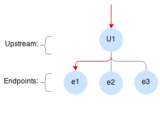
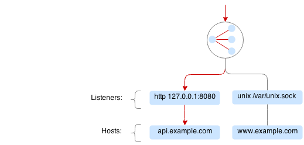
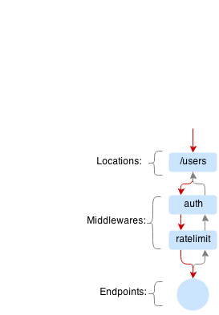
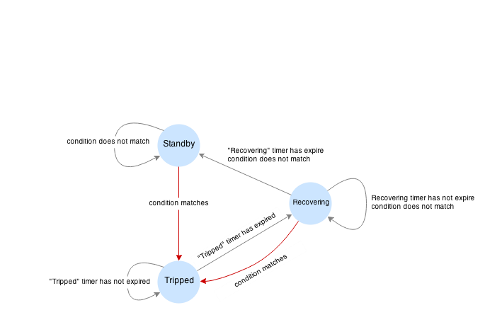

.. _proxy:

User Manual
===========

Glossary
--------

Familiarizing with the glossary would help to understand the rest of this guide.

Host
~~~~

Hostname is defined by incoming ``Host`` header. E.g. ``curl http://example.com/alice`` generates the following request:

.. code-block:: sh

 GET /alice HTTP/1.1
 User-Agent: curl/7.35.0
 Host: example.com

Vulcand hosts contain associated information and settings, such as SNI options and TLS certificates.

Listener
~~~~~~~~
Listener is a dynamic socket that can be attached or detached to Vulcand without restart. Vulcand can have multiple http and https listeners 
attached to it, providing service on multiple interfaces and protocols.

Frontend
~~~~~~~~
Frontends match the requests and forward it to the backends. 
Each frontend defines a route - a special expression that matches the request, e.g. ``Path("/v1/path")``.
Frontends are linked to backend and Vulcand will use the servers from this backend to serve the request.

Backend
~~~~~~~
Backend is a collection of servers, they control connection pools to servers and transport options, such as connection, read and write timeouts.

Server
~~~~~~
Server is a final destination of the incoming request, each server is defined by URL ``<schema>://<host>:<port>``, e.g. ``http://localhost:5000``.

Middleware
~~~~~~~~~~
Vulcand supports pluggable middlewares. Middlewares can intercept or transform the request to any frontend. Examples of the supported middlewares are rate limits and connection limits.
You can add or remove middlewares using command line, API or directly via backends.

Circuit Breaker
~~~~~~~~~~~~~~~
Circuit breakers are special type of middlewares that observe various metrics for a particular frontend and can activate failover scenario whenever the condition matches  e.g. error rate exceeds the threshold.

Secret storage
~~~~~~~~~~~~~~
Vulcand supports secret storage - running process acts like encryption/decryption service every time it reads and writes sensitive data, e.g. TLS certificates to the backend.
To use this feature, users generate ``sealKey`` using command line utility and pass this key to the process for encryption and decryption of the data in the backends.

Failover Predicates
~~~~~~~~~~~~~~~~~~~

Sometimes it is handy to retry the request on error. The good question is what constitutes an error? Sometimes it's a read/write timeout, and somethimes it's a special error code. 
Failover predicates are expressions that define when the request can be failed over, e.g.  ``IsNetworkError() && Attempts <= 2``

.. code-block:: bash

   IsNetworkError()         # failover on network error
   Attempts() <= 1          # allows only 1 failover attempt
   RequestMethod() == "GET" # failover for GET requests only
   ResponseCode() == 408    # failover on 408 HTTP response code

.. warning::  if you omit `Attempts`, failover will max out after 10 attempts.

Route
~~~~~

Route is a simple routing language for matching http requests with Go syntax: ``Method("POST") && Path("/path")``, here are a couple of examples:

.. code-block:: go

   Host("<user>.example.com")            // Match by host with trie syntax
   HostRegexp(".*.example.com")          // Match by host with regexp syntax

   Path("/v1/users/<user>")              // Match by path with trie syntax
   Method("POST") && Path("/v1/users")   // Match by method and path with trie syntax

   PathRegexp("/v1/users/.*")                                 // Match by path with regexp syntax
   MethodRegexp("DELETE|GET") && PathRegexp("/v1/users/.*")   // Match by method and path with regexp syntax

   Header("Content-Type", "application/<subtype>")            // trie-based matcher for headers
   HeaderRegexp("Content-Type", "application/.*")             // regexp based matcher for headers

Configuration
-------------

Vulcand can be configured via Etcd, API or command line tool - ``vctl``. You can switch between different configuration examples using the samples switch.

Backends and servers
~~~~~~~~~~~~~~~~~~~~~~~

Backend is a collection of servers. Vulcand load-balances requests within the backend and keeps the connection pool to every server.
Frontends using the same backend will share the connections.

Adding and removing servers to the backend will change the traffic in real-time, removing the backend will lead to graceful drain off of the connections.

.. code-block:: etcd

 # Upsert backend and add a server to it
 etcdctl set /vulcand/backends/b1/backend '{"Type": "http"}'
 etcdctl set /vulcand/backends/b1/servers/srv1 '{"URL": "http://localhost:5000"}'

.. code-block:: cli

 # Upsert backend and add a server to it
 vctl backend upsert -id b1
 vctl server upsert -b b1 -id srv1 -url http://localhost:5000

.. code-block:: api

 # Upsert backend and add a server to it
 curl -X POST -H "Content-Type: application/json" http://localhost:8182/v2/backends\
      -d '{"Backend": {"Id":"b1", "Type":"http"}}'
 curl -X POST -H "Content-Type: application/json" http://localhost:8182/v2/backends/b1/servers\
      -d '{"Server": {"Id":"srv1", "URL":"http://localhost:5000"}}'

**Backend settings**

Backends define the configuration options to the servers, such as the amount of idle connections and timeouts.
Backend options are represented as JSON dictionary. 

.. code-block:: javascript

 {
   "Timeouts": {
      "Read":         "1s", // Socket read timeout (before we receive the first reply header)
      "Dial":         "2s", // Socket connect timeout
      "TLSHandshake": "3s", // TLS handshake timeout
   },
   "KeepAlive": {
      "Period":              "4s",  // Keepalive period for idle connections
      "MaxIdleConnsPerHost": 3,     // How many idle connections will be kept per host
   }
 }

You can update the settings at any time, that will initiate graceful reload of the underlying settings in Vulcand.

.. code-block:: etcd

 etcdctl set /vulcand/backends/b1/backend '{"Type": "http", "Settings": {"KeepAlive": {"MaxIdleConnsPerHost": 128, "Period": "4s"}}}'

.. code-block:: cli

 vctl backend upsert -id b1 \
          -readTimeout=1s -dialTimeout=2s -handshakeTimeout=3s\
          -keepAlivePeriod=4s -maxIdleConns=128

.. code-block:: api

 curl -X POST -H "Content-Type: application/json" http://localhost:8182/v2/backends\
      -d '{"Backend": {"Id":"b1", "Type":"http", "Settings": {"KeepAlive": {"MaxIdleConnsPerHost": 128, "Period": "4s"}}}}'

**Server heartbeat**

Heartbeat allows to automatically de-register the server when it crashes or wishes to be de-registered. 
Server can heartbeat it's presense, and once the heartbeat is stopped, Vulcand will gracefully remove the server from the rotation.

.. code-block:: etcd

 # Upsert a server with TTL 5 seconds
 etcdctl set --ttl 5 /vulcand/backends/b1/servers/srv2 '{"URL": "http://localhost:5001"}'

.. code-block:: cli

 # Upsert a server with TTL 5 seconds
 vctl server upsert -b b1 -id srv2 -ttl 5s -url http://localhost:5002

.. code-block:: api

 # Upsert a server with TTL 5 seconds
 curl -X POST -H "Content-Type: application/json" http://localhost:8182/v2/backends/b1/servers\
      -d '{"Server": {"Id":"srv2", "URL":"http://localhost:5001"}, "TTL": "5s"}'

Frontends
~~~~~~~~~

.. figure::  _static/img/VulcanFrontend.png
   :align:   left

If request matches a frontend route it is redirected to one of the servers of the associated backend.
It is recommended to specify a frontend per API method, e.g. ``Host("api.example.com") && Method("POST") && Path("/v1/users")``.

Route can be any valid route expression, e.g. ``Path("/v1/users")`` will match for all hosts and 
``Host("api.example.com") && Path("/v1/users")`` will match only for ``api.example.com``.

.. code-block:: etcd

 # upsert frontend connected to backend b1 and matching path "/"
 etcdctl set /vulcand/frontends/f1/frontend '{"Type": "http", "BackendId": "b1", "Route": "Path(`/`)"}'

.. code-block:: cli

 # upsert frontend connected to backend b1 and matching path "/"
 vctl frontend upsert -id f1 -b b1 -route 'Path("/")'

.. code-block:: api

 # upsert frontend connected to backend b1 and matching path "/"
 curl -X POST -H "Content-Type: application/json" http://localhost:8182/v2/frontends\
       -d '{"Frontend": {"Id":"f1", "Type": "http", "BackendId": "b1", "Route": "Path(\"/\")"}}'

**Frontend settings**

Frontends control various limits, forwarding and failover settings.

.. code-block:: javascript

 {
   "Limits": {
     "MaxMemBodyBytes": 12,  // Maximum request body size to keep in memory before buffering to disk
     "MaxBodyBytes": 400,    // Maximum request body size to allow for this frontend
   },
   "FailoverPredicate":  "IsNetworkError() && Attempts() <= 1", // Predicate that defines when requests are allowed to failover
   "Hostname":           "host1",                               // Host to set in forwarding headers
   "TrustForwardHeader": true,                                  // Time provider (useful for testing purposes)
 }

Setting frontend settings upates the limits and parameters for the newly arriving requests in real-time.

.. code-block:: etcd

 etcdctl set /vulcand/frontends/f1/frontend '{"Id": "f1", "Type": "http", "BackendId": "b1", "Route": "Path(`/`)", "Settings": {"FailoverPredicate":"(IsNetworkError() || ResponseCode() == 503) && Attempts() <= 2"}}'

.. code-block:: cli

 vctl frontend upsert\
         -id=f1\
         -route='Path("/")'\
         -b=b1\
         -maxMemBodyKB=6 -maxBodyKB=7\
         -failoverPredicate='IsNetworkError()'\
         -trustForwardHeader\
         -forwardHost=host1

.. code-block:: api

 curl -X POST -H "Content-Type: application/json" http://localhost:8182/v2/frontends\
      -d '{"Frontend": {"Id": "f1", "Type": "http", "BackendId": "b1", "Route": "Path(`/`)", "Settings": {"FailoverPredicate":"(IsNetworkError() || ResponseCode() == 503) && Attempts() <= 2"}}}'

**Switching backends**

Updating frontend's backend property gracefully re-routes the traffic to the new servers assigned to this backend:

.. code-block:: etcd

 # redirect the traffic of the frontend "loc1" to the servers of the backend "b2"
 etcdctl set /vulcand/frontends/f1/frontend '{"Type": "http", "BackendId": "b2", "Route": "Path(`/`)"}'

.. code-block:: cli

 # redirect the traffic of the frontend "f1" to the servers of the backend "b2"
 vctl frontend upsert -id=f1 -route='Path("/")' -b=b2

.. code-block:: api

 # redirect the traffic of the frontend "loc1" to the servers of the backend "up2"
  curl -X POST -H "Content-Type: application/json" http://localhost:8182/v2/frontends -d '{"Frontend": {"Id": "f1", "Type": "http", "BackendId": "b2", "Route": "Path(`/`)"}}'

.. note::  you can add and remove servers to the existing backend, and Vulcand will start redirecting the traffic to them automatically

Hosts
~~~~~

One can use Host entries to specify host-related settings, such as TLS certificates and SNI options.

**TLS Certificates**

Certificates are stored as encrypted JSON dictionaries. Updating a certificate will gracefully reload it for all running HTTP servers.

.. code-block:: etcd

 # Set keypair
 etcdctl set /vulcand/hosts/localhost/host '{"Settings": {"KeyPair": {...}}}'

.. code-block:: cli

 vctl host upsert -name <host> -cert=</path-to/chain.crt> -privateKey=</path-to/key>

.. code-block:: api

 curl -X POST -H "Content-Type: application/json" http://localhost:8182/v2/hosts\
      -d '{"Host": { "Name": "localhost", "Settings": {"KeyPair": {"Cert": "base64", Key: "base64"}}}}'

.. note:: When setting keypair via Etcd you need to encrypt keypair. This is explained in `TLS`_ section of this document.

**OCSP**

`Online Certificate Status Protocol <http://en.wikipedia.org/wiki/Online_Certificate_Status_Protocol>`_ is a protocol for certificate revocation checking. Vulcand checks OCSP status in the background and 
includes the OCSP staple response in the TLS handshake when this feature turned on.

Read more about turning OCSP for hosts in `OCSP`_ section of this document.

Routing Language
~~~~~~~~~~~~~~~~

Vulcand uses a special type of a routing language to match requests - called ``route`` and implemented as a `standalone library <https://github.com/mailgun/route>`_
It uses Go syntax to route http requests by by hostname, method, path and headers. Every Vulcand frontend has a special ``Route`` field for routing requests.

Here is the syntax explained:

.. code-block:: go

   Matcher("value")          // matches value using trie
   Matcher("<string>.value") // uses trie-based matching for a.value and b.value
   MatcherRegexp(".*value")  // uses regexp-based matching

Host matcher:

.. code-block:: go

  Host("<subdomain>.localhost") // trie-based matcher for a.localhost, b.localhost, etc.
  HostRegexp(".*localhost")     // regexp based matcher

Path matcher:

.. code-block:: go

  Path("/hello/<value>")   // trie-based matcher for raw request path
  PathRegexp("/hello/.*")  // regexp-based matcher for raw request path

Method matcher:

.. code-block:: go

  Method("GET")            // trie-based matcher for request method
  MethodRegexp("POST|PUT") // regexp based matcher for request method

Header matcher:

.. code-block:: go

  Header("Content-Type", "application/<subtype>") // trie-based matcher for headers
  HeaderRegexp("Content-Type", "application/.*")  // regexp based matcher for headers

Matchers can be combined using ``&&`` operator:

.. code-block:: go

  Host("localhost") && Method("POST") && Path("/v1")

Vulcan will join the trie-based matchers into one trie matcher when possible, for example:

.. code-block:: go

  Host("localhost") && Method("POST") && Path("/v1")
  Host("localhost") && Method("GET") && Path("/v2")

Will be combined into one trie for performance. If you add a third route:

.. code-block:: go

  Host("localhost") && Method("GET") && PathRegexp("/v2/.*")

It wont be joined ito the trie, and would be matched separately instead.

.. warning:: Vulcan can not merge regexp-based routes into efficient structure, so if you have hundreds/thousands of frontends, use trie-based routes!

Host based routing
//////////////////

Vulcand does not require host-specific routing, e.g. the frontend with the following route will match all requests regardless of their hostname:

.. code-block:: go

  PathRegexp("/.*")

.. code-block:: bash
   
   curl -H "Host:example.com" http://localhost/hello # works
   curl -H "Host:hello.com" http://localhost/hello   # also works

In case if you need Host-based routing (just as Apache's ``VHost`` or Nginx's ``Server`` names), you can use the routes:

.. code-block:: go

  Host("example.com") && PathRegexp("/.*")

.. code-block:: bash
   
   curl -H "Host:example.com" http://localhost/hello # works
   curl -H "Host:hello.com" http://localhost/hello   # not found

.. note::  The example above do not set up host entries in Vulcand. You only need them when using HTTPS to supply certificates.

Method matching
///////////////

Vulcand works better when creating a separate frontend for each HTTP method in your API:

.. code-block:: go

  Host("localhost") && Method("POST") && Path("/users")
  Host("localhost") && Method("GET") && Path("/users")

In this case each frontend collects separate set of realtime metrics that are different for creating and gettings users. This separation will provide separate histograms and separate load balancing logic for different request types what helps to understand the performance better.

Listeners
~~~~~~~~~

Listeners allow attaching and detaching sockets on various interfaces and networks.
Vulcand can have multiple listeners attached and share the same listener.

.. code-block:: javascript

 {
    "Protocol":"http",            // 'http' or 'https'
    "Scope": "",                  // optional scope field, read below for details
    "Address":{
       "Network":"tcp",           // 'tcp' or 'unix'
       "Address":"localhost:8183" // 'host:port' or '/path/to.socket'
    },
 }

.. code-block:: etcd

 # Add http listener accepting requests on 127.0.0.1:8183
 etcdctl set /vulcand/listeners/ls1\
            '{"Protocol":"http", "Address":{"Network":"tcp", "Address":"127.0.0.1:8183"}}'

.. code-block:: cli

 # Add http listener accepting requests on 127.0.0.1:80
 vctl listener upsert --id ls1 --proto=http --net=tcp -addr=127.0.0.1:8080

.. code-block:: api

 # Add http listener accepting requests on 127.0.0.1:8183
 curl -X POST -H "Content-Type: application/json" http://localhost:8182/v2/listeners\
      -d '{"Listener":{"Id": "ls1", "Protocol":"http", "Address":{"Network":"tcp", "Address":"127.0.0.1:8183"}}}'

**Listener scopes**

Listeners support scopes as the way to limit operational scope of socket. 
Scope field uses Vulcand `Routing Language`_.
Here's an example of Listener that only allows requests with hostname ``example.com``

.. code-block:: javascript

 {
    "Protocol":"http",              // 'http' or 'https'
    "Scope": "Host(`example.com`)", // operational scope
    "Address":{
       "Network":"tcp",           // 'tcp' or 'unix'
       "Address":"0.0.0.0:8183" // 'host:port' or '/path/to.socket'
    },
 }

E.g. if we have two frontends defined:

.. code-block:: javascript

 Host("example.com") && Path("/users")
 Host("localhost") && Path("/users")

Only first frontend is reachable for requests coming to port ``8183``.

Middlewares
~~~~~~~~~~~

Middlewares are allowed to observe, modify and intercept http requests and responses. Vulcand provides several middlewares. 
Users can write their own middlewares for Vulcand in Go.

To specify execution order of the middlewares, one can define the priority. Middlewares with smaller priority values will be executed first.

Rate Limits
~~~~~~~~~~~

Vulcan supports controlling request rates. Rate can be checked against different request parameters and is set up via limiting variable.

.. code-block:: bash
   
   client.ip                       # client ip
   request.header.X-Special-Header # request header

Adding and removing middlewares will modify the frontend behavior in real time. One can set expiring middlewares as well.

.. code-block:: etcd

 # Update or set rate limit the request to frontend "f1" to 1 request per second per client ip 
 # with bursts up to 3 requests per second.
 etcdctl set /vulcand/frontends/f1/middlewares/rl1 '{
    "Priority": 0, 
    "Type": "ratelimit", 
    "Middleware":{
        "Requests":1, 
        "PeriodSeconds":1, 
        "Burst":3, 
        "Variable": "client.ip"}}'

.. code-block:: cli

 # Update or set rate limit the request to frontend "f1" to 1 request per second per client ip 
 # with bursts up to 3 requests per second.
 vctl ratelimit upsert -id=rl1 -frontend=f1 -requests=1 -burst=3 -period=1 --priority=0

.. code-block:: api

 # Update or set rate limit the request to frontend "f1" to 1 request per second per client ip 
 # with bursts up to 3 requests per second.
 curl -X POST -H "Content-Type: application/json" http://localhost:8182/v2/frontends/f1/middlewares\
      -d '{"Middleware": {
        "Priority": 0, 
        "Type": "ratelimit",
        "Id": "rl1",
        "Middleware":{
            "Requests":1, 
            "PeriodSeconds":1, 
            "Burst":3, 
            "Variable": "client.ip"}}}'

**Programmatic rate limits**

Sometimes you have to change rate limits based on various parameters, e.g. account billing plan. Instead of setting hard-coded rate limits, Vulcand can accept rate limits
set via headers for each individual request. 

Each HTTP header should contain a JSON-encoded list with rates in the following format:

.. code-block:: json

  [{"PeriodSeconds": 1, "Requests": 2, "Burst": 3}]

That means that you should write a middleware that sets the header to the right value and place it before the ratelimit middleware. 

After it's done you can activate the ratelimit plugin:

.. code-block:: etcd

 # Update or set rate limit the request to frontend "f1" to get the rates from the X-Custom-Rates.
 # in case if the header is missing, ratelimit will default to 1 request per second per client ip  
 # with bursts up to 3 requests per second.
 etcdctl set /vulcand/frontends/f1/middlewares/rl1 '{
    "Id":"rl1",
    "Priority":0,
    "Type":"ratelimit",
    "Middleware":{
       "PeriodSeconds":1,
       "Requests":1,
       "Burst":3,
       "Variable":"client.ip",
       "RateVar":"request.header.X-Custom-Rates"}}'

.. code-block:: cli

 # Update or set rate limit the request to frontend "f1" to get the rates from the X-Custom-Rates.
 # in case if the header is missing, ratelimit will default to 1 request per second per client ip  
 # with bursts up to 3 requests per second.
 vctl ratelimit upsert -id=rl1 -frontend=f1 -requests=1 -burst=3 -period=1 --priority=0 --rateVar="request.header.X-Custom-Rates"

.. code-block:: api

 # Update or set rate limit the request to frontend "f1" to get the rates from the X-Custom-Rates.
 # in case if the header is missing, ratelimit will default to 1 request per second per client ip  
 # with bursts up to 3 requests per second.
 curl -X POST -H "Content-Type: application/json" http://localhost:8182/v2/frontends/f1/middlewares -d '{
    "Middleware": {
        "Id":"rl1",
        "Priority":0,
        "Type":"ratelimit",
        "Middleware":{
           "PeriodSeconds":1,
           "Requests":1,
           "Burst":3,
           "Variable":"client.ip",
           "RateVar":"request.header.X-Custom-Rates"}}}'

Connection Limits
~~~~~~~~~~~~~~~~~

Connection limits control the amount of simultaneous connections per frontend. Frontends re-use the same variables as rate limits.

.. code-block:: etcd

 # limit the amount of connections per frontend to 16 per client ip
 etcdctl set /vulcand/frontends/f1/middlewares/cl1\
        '{"Priority": 0, "Type": "connlimit", "Middleware":{"Connections":16, "Variable": "client.ip"}}'

.. code-block:: cli

 # limit the amount of connections per frontend to 16 per client ip
 vctl connlimit upsert -id=cl1 -frontend=f1 -connections=1 --priority=0 --variable=client.ip

.. code-block:: api

 # limit the amount of connections per frontend to 16 per client ip
 curl -X POST -H "Content-Type: application/json" http://localhost:8182/v2/frontends/f1/middlewares\
      -d '{"Middleware": {"Id": "cl1", "Priority": 0, "Type": "connlimit", "Middleware":{"Connections":16, "Variable": "client.ip"}}}'

Rewrites and redirects
~~~~~~~~~~~~~~~~~~~~~~

Rewrite plugin enables rewriting request URLs, returning redirect responses and changing response bodies.

**Rewrites**

.. code-block:: etcd

 # remove /foo prefix from the url
 etcdctl set /vulcand/frontends/f1/middlewares/r1 '{
    "Id":"r1",
    "Priority":1,
    "Type":"rewrite",
    "Middleware":{
       "Regexp":"/foo(.*)",
       "Replacement":"$1",
       "RewriteBody":false,
       "Redirect":false}}'

.. code-block:: cli

 # remove /foo prefix from the url, note the single quotes for '$1'
 vctl rewrite upsert -f f1 -id r1 --regexp="/foo(.*)" --replacement='$1'

.. code-block:: api

 # remove /foo prefix from the url
 curl -X POST -H "Content-Type: application/json" http://localhost:8182/v2/frontends/f1/middlewares\
      -d '{"Middleware": {
          "Id":"r1",
          "Priority":1,
          "Type":"rewrite",
          "Middleware":{
             "Regexp":"/foo(.*)",
             "Replacement":"$1",
             "RewriteBody":false,
             "Redirect":false}}}'

**Redirects**

Setting a ``redirect`` parameter to rewrite will make it to generate ``302 Found`` response with ``Location`` header
set to the new URL:

.. code-block:: etcd

 # remove /foo prefix from the url
 etcdctl set /vulcand/frontends/f1/middlewares/r1 '{
    "Id":"r1",
    "Priority":1,
    "Type":"rewrite",
    "Middleware":{
       "Regexp":"^http://localhost/(.*)",
       "Replacement":"https://localhost/$1",
       "RewriteBody":false,
       "Redirect":true}}'

.. code-block:: cli

 # redirect http requests to https location
 vctl rewrite upsert -f f1 -id r1 --regexp="^http://localhost/(.*)" --replacement='https://localhost/$1' --redirect

.. code-block:: api

 # remove /foo prefix from the url
 curl -X POST -H "Content-Type: application/json" http://localhost:8182/v2/frontends/f1/middlewares\
      -d '{"Middleware": {
          "Id":"r1",
          "Priority":1,
          "Type":"rewrite",
          "Middleware":{
             "Regexp":"^http://localhost/(.*)",
             "Replacement":"https://localhost/$1",
             "RewriteBody":false,
             "Redirect":true}}}'

**Templating**

Rewrite can treat the response body as a template. Consider the following example:

.. code-block:: etcd

 # treat response body as a template
 etcdctl set /vulcand/frontends/f1/middlewares/r1 '{
    "Id":"r1",
    "Priority":1,
    "Type":"rewrite",
    "Middleware":{"RewriteBody":true}}'

.. code-block:: cli

 # treat response body as a template
 vctl rewrite upsert -f f1 -id r1 --rewriteBody

.. code-block:: api

 # treat response body as a template
 curl -X POST -H "Content-Type: application/json" http://localhost:8182/v2/frontends/f1/middlewares\
      -d '{"Middleware": {
          "Id":"r1",
          "Priority":1,
          "Type":"rewrite",
          "Middleware":{"RewriteBody":true}}}'

The backend server can now reply:

.. code-block:: go

	handler := http.HandlerFunc(func(w http.ResponseWriter, req *http.Request) {
		w.WriteHeader(200)
		w.Write([]byte(`{"foo": "{{.Request.Header.Get "variable-value"}}"}`))
	})

And the client will get as a response:

.. code-block:: go

   {"foo": "variable-value"}

Structured logs
~~~~~~~~~~~~~~~

.. warning:: We are still polishing the log format, so it may change soon.

``trace`` plugin supports output in syslog-compatible format of the structured logs to UDP or Unix socket.

Here's the example of the log entry:

.. code-block:: bash

 Jan 13 15:07:51 vulcan pid:[3634]: @cee: {"request":{"method":"GET","url":"http://h:5000"},"response":{"code":404,"roundtrip":0.333712}}

The prefix is a standard syslog prefix, and the part after ``@cee:`` is a structured log entry. Here's the entry format explained:

.. code-block:: js

 {
  "request": {
    "method": "GET",                   // request method
    "url": "http://localhost:5000",    // request URL
    "headers": {                       // optional captured request headers
      "User-Agent": [                  // captured request User-Agent header values
        "curl\/7.35.0"
      ]
    },
    "tls": {                           // tls is an optonal field, used when it's a TLS connection
      "version": "TLS12",              // TLS version used
      "resume": false,                 // whether it's a session resumed with session ticket
      "cipher_suite": "TLS_ECDHE_RSA_WITH_AES_256_CBC_SHA", // cipher used in a connection
      "server": "vulcand.io"           // server name used in SNI
    }
  },
  "response": {
    "code": 404,                     // response code
    "roundtrip": 0.408372,           // roundtrip in milliseconds, part after '.' is microseconds
    "headers": {                     // optional captured response headers
      "Content-Type": [
        "text\/plain; charset=utf-8" // captured response Content-Type header values
      ]
    }
  }
 }

Adding and removing trace middleware will turn on/off tracing in real time.

.. code-block:: etcd

 # turn tracing on, pointing output to unix syslog facility.
 # capture request header values 'X-A' and 'X-B' and response headers 'X-C' and 'X-D'
 etcdctl set /vulcand/frontends/f1/middlewares/t1 '{
   "Id":"t1",
   "Priority":1,
   "Type":"trace",
   "Middleware":{
     "ReqHeaders":["X-A","X-B"],
     "RespHeaders":["X-C","X-D"],
     "Addr":"syslog://"}}'

.. code-block:: cli

 # turn tracing on, pointing output to unix syslog facility.
 # capture request header values 'X-A' and 'X-B' and response headers 'X-C' and 'X-D'
 vctl trace upsert -f f1 -id t1 --addr='syslog://'\
    --reqHeader=X-A --reqHeader=X-B --respHeader=X-C --respHeader=X-D

.. code-block:: api

 # turn tracing on, pointing output to unix syslog facility.
 # capture request header values 'X-A' and 'X-B' and response headers 'X-C' and 'X-D'
 curl -X POST -H "Content-Type: application/json" http://localhost:8182/v2/frontends/f1/middlewares -d '{
   "Middleware": {
   "Id":"t1",
   "Priority":1,
   "Type":"trace",
   "Middleware":{
     "ReqHeaders":["X-A","X-B"],
     "RespHeaders":["X-C","X-D"],
     "Addr":"syslog://"}}}'

**Controlling output**

You can control output using the following form of address values:

.. code-block:: bash

  # UDP socket formats
  syslog://localhost:5000                        # host localhost, port 5000, LOG_LOCAL0 facility
  syslog://localhost:5000?f=MAIL&sev=INFO        # host localhost, port 5000, MAIL facility, INFO severity
  syslog://localhost:5000?f=MAIL                 # host localhost, port 5000, MAIL facility, INFO severity
  syslog://localhost:5000?f=LOG_LOCAL0&sev=DEBUG # host localhost, port 5000, LOG_LOCAL0 facility, INFO severity

  # unixgram  socket format
  syslog:///tmp/out.sock            # /tmp/out.sock unixgram socket
  syslog:///tmp/out.sock?f=MAIL     # /tmp/out.sock unixgram socket

  # default syslog
  syslog://                        # default OS-specific unix/unixgram socket
  syslog://?f=LOG_LOCAL0&sev=INFO  # default OS-specific unix/unixgram socket

Circuit Breakers
~~~~~~~~~~~~~~~~

.. figure::  _static/img/CircuitStandby.png
   :align:   left

Circuit breaker is a special middleware that is designed to provide a fail-over action in case if service has degraded. 
It is very helpful to prevent cascading failures - where the failure of the one service leads to failure of another.
Circuit breaker observes requests statistics and checks the stats against special error condition.

.. figure::  _static/img/CircuitTripped.png
   :align:   left

In case if condition matches, CB activates the fallback scenario: returns the response code or redirects the request to another frontend. 

**Circuit Breaker states**

CB provides a set of explicit states and transitions explained below:

- Initial state is ``Standby``. CB observes the statistics and does not modify the request.
- In case if condition matches, CB enters ``Tripped`` state, where it responds with predefines code or redirects to another frontend.
- CB can execute the special HTTP callback when going from ``Standby`` to ``Tripped`` state
- CB sets a special timer that defines how long does it spend in the ``Tripped`` state
- Once ``Tripped`` timer expires, CB enters ``Recovering`` state and resets all stats
- In ``Recovering`` state Vulcand will start routing the portion of the traffic linearly increasing it over the period specified in ``Recovering`` timer.
- In case if the condition matches in ``Recovering`` state, CB enters ``Tripped`` state again
- In case if the condition does not match and recovery timer expries, CB enters ``Standby`` state.
- CB can execute the special HTTP callback when going from ``Recovering`` to ``Standby`` state

**Conditions**

CB defines a simple language that allows us to specify simple conditions that watch the stats for a frontend:

.. code-block:: javascript

 NetworkErrorRatio() > 0.5      // watch error ratio over 10 second sliding window for a frontend
 LatencyAtQuantileMS(50.0) > 50 // watch latency at quantile in milliseconds.
 ResponseCodeRatio(500, 600, 0, 600) > 0.5 // ratio of response codes in range [500-600) to  [0-600)

.. note::  Quantiles should be provided as floats - don't forget to add .0 to hint it as float

**Response fallback**

Response fallback will tell CB to reply with a predefined response instead of forwarding the request to the backend

.. code-block:: javascript

 {
    "Type": "response", 
    "Action": {
       "ContentType": "text/plain",
       "StatusCode": 400, 
       "Body": "Come back later"
    }
 }

**Redirect fallback**

Redirect fallback will redirect the request to another frontend.

.. note::  It won't work for frontends not defined in the Vulcand config.

.. code-block:: javascript

 {
    "Type": "redirect", 
    "Action": {
       "URL": "https://example.com/fallback"
    }
 }

**Webhook Action**

Circuit breaker can notify extenral sources on it's state transitions, e.g. it can create a pager duty incident by issuing a webhook:

.. code-block:: javascript

 {
  "Body": {
      "client": "Sample Monitoring Service",
      "client_url": "https://example.com",
      "description": "FAILURE for production/HTTP on machine srv01.acme.com",
      "event_type": "trigger",
      "incident_key": "srv01/HTTP",
      "service_key": "-pager-duty-service-key"
  },
  "Headers": {
      "Content-Type": [
          "application/json"
      ]
  },
  "Method": "POST",
  "URL": "https://events.pagerduty.com/generic/2010-04-15/create_event.json"
 }

**Setup**

Circuit breaker setup is can be done via Etcd, command line or API:

.. code-block:: etcd

 etcdctl set /vulcand/frontends/f1/middlewares/cb1 '{
              "Id":"cb1",
              "Priority":1,
              "Type":"cbreaker",
              "Middleware":{
                 "Condition":"NetworkErrorRatio() > 0.5",
                 "Fallback":{"Type": "response", "Action": {"StatusCode": 400, "Body": "Come back later"}},
                 "FallbackDuration": 10000000000,
                 "RecoveryDuration": 10000000000,
                 "CheckPeriod": 100000000
              }
            }'

.. code-block:: cli

 vctl cbreaker upsert \
                   --frontend=f1 \
                   --id=cb1\
                   --condition="NetworkErrorRatio() > 0.5" \
                   --fallback='{"Type": "response", "Action": {"StatusCode": 400, "Body": "Come back later"}}'

.. code-block:: api

 curl -X POST -H "Content-Type: application/json"\
      http://localhost:8182/v2/frontends/f1/middlewares\
      -d '{
           "Middleware": {
              "Id":"cb1",
              "Priority":1,
              "Type":"cbreaker",
              "Middleware":{
                 "Condition":"NetworkErrorRatio() > 0.5",
                 "Fallback":{
                    "Type": "response", 
                    "Action": {"StatusCode": 400, "Body": "Come back later"}
                 },
                 "FallbackDuration": 10000000000,
                 "RecoveryDuration": 10000000000,
                 "CheckPeriod": 100000000
              }
            }
         }'

TLS
---

Vulcand supports HTTPS via `SNI <http://en.wikipedia.org/wiki/Server_Name_Indication>`_, certificate management and multiple HTTPS servers per running process.
This sections below contain all the steps required to enable TLS support in Vulcand

Managing certificates
~~~~~~~~~~~~~~~~~~~~~

Vulcand encrypts certificates when storing them in the backends and uses `Nacl secretbox <https://godoc.org/code.google.com/p/go.crypto/nacl/secretbox>`_ to seal the data. 
The running server acts as an encryption/decryption point when reading and writing certificates.

This special key has to be generated by Vulcand using command line utility:

**Setting up seal key**

.. code-block:: bash 

 $ vctl secret new_key

Once we got the key, we can pass it to the running daemon. This key will be used by Vulcand to encrypt and decrypt stored certificates and private keys.

.. code-block:: bash

 $ vulcand -sealKey="the-seal-key"

.. note:: Add space before command to avoid leaking seal key in bash history, or use ``HISTIGNORE``
.. warning:: Vulcand needs the `sealKey` to use TLS, without it simply will refuse to set the certificates for host.

**Setting host keypair**

Setting certificate via etcd is slightly different from CLI and API:

.. code-block:: etcd

 # Read the private key and certificate and returns back the encrypted version that can be passed to etcd
 $ vctl secret seal_keypair -sealKey <seal-key> -cert=</path-to/chain.crt> -privateKey=</path-to/key>

 # Once we got the certificate sealed, we can pass it to the Etcd:
 etcdctl set /vulcand/hosts/mailgun.com/host '{"Settings": {"KeyPair": {..encrypted data...}}}'

.. code-block:: cli

 # Connect to Vulcand Update the TLS certificate.
 # In this case we don't need to supply seal key, as in this case the CLI talks to the Vulcand directly
 $ vctl host upsert -name <host> -cert=</path-to/chain.crt> -privateKey=</path-to/key>

.. code-block:: api

 # In this case we don't need to supply seal key, as in this case the CLI talks to the Vulcand directly
 curl -X POST -H "Content-Type: application/json" http://localhost:8182/v2/hosts\
      -d '{"Host": {"Name": "localhost", "Settings": {"KeyPair": {"Cert": "base64-encoded-certificate", "Key": "base64-encoded-key-string"}}}}'

.. note::  To update the certificate in the live mode just repeat the steps with the new certificate, vulcand will gracefully reload the TLS config for running server

OCSP
~~~~

`Online Certificate Status Protocol <http://en.wikipedia.org/wiki/Online_Certificate_Status_Protocol>`_ is a protocol for certificate revocation checking. Vulcand checks OCSP status in the background and 
includes the OCSP staple response in the TLS handshake when this feature turned on. 
By default it is turned off, mostly because it provides `questionable benefits <https://www.imperialviolet.org/2014/04/19/revchecking.html>`_.

.. code-block:: etcd

 # Set keypair and OCSP settings
 etcdctl set /vulcand/hosts/localhost/host '{"Settings": 
     {"KeyPair": {...}, "OCSP":{"Enabled":true,"Period":"1h0m0s","Responders":[],"SkipSignatureCheck":false}}}'

.. code-block:: cli

 # set keypair and OCSP settings
 # --ocsp               // turn OCSP on
 # --ocspSkipCheck      // insecure: skip OCSP signature check
 # --ocspPeriod='1h'    //  override OCSP check period defined in the certificate, use '1h','30m' as time periods
 # --ocspResponder      //   optional OCSP responder, use multiple args for responder list
 vctl host upsert -name example.com -cert=</path-to/chain.crt> -privateKey=</path-to/key>\
   --ocsp
   --ocspSkipCheck
   --ocspPeriod='1h'
   --ocspResponder="http://example.com/respond"

.. code-block:: api

 #set keypair and OCSP settings
 curl -X POST -H "Content-Type: application/json" http://localhost:8182/v2/hosts\
      -d '{"Host": { 
             "Name": "localhost", 
             "Settings": {
                "KeyPair": {"Cert": "base64", Key: "base64"}, 
                 "OCSP":{
                     "Enabled":true,
                     "Period":"1h0m0s",
                     "Responders":[],
                     "SkipSignatureCheck":false}}}}}'

SNI
~~~

Not all clients support SNI, or sometimes host name is not available. In this case you can set the ``default`` certificate that will be returned in case if the SNI is not available:

.. code-block:: etcd

 # Set example.com as default host returned in case if SNI is not available
 etcdctl set /vulcand/hosts/example.com/host '{"Settings": {"Default": true, "KeyPair": {...}}}'

Session Tickets
~~~~~~~~~~~~~~~
`Session tickets <http://en.wikipedia.org/wiki/Transport_Layer_Security#Session_tickets>`_ is a way to resume TLS connection, saving time on a TLS handshake. 
Vulcand supports in-memory session tickets cache for HTTPS listeners and backend pools. Session tickets are enabled by default

.. code-block:: etcd

 # Add http listener accepting requests on 127.0.0.1:9443, uses session ticket LRU cache of 1024
 etcdctl set /vulcand/listeners/ls1\
            '{"Id":"ls1","Protocol":"https","Address":{"Network":"tcp","Address":"127.0.0.1:9443"},
              "Settings":{
                "TLS":{
                  "SessionTicketsDisabled":false,
                  "SessionCache":{"Type":"LRU","Settings":{"Capacity":1024}}}}}'

.. code-block:: cli

 # Add http listener accepting requests on 127.0.0.1:9443, uses session ticket LRU cache of 1024
 vctl listener upsert --id ls1 --proto=https --net=tcp -addr=127.0.0.1:9443\
      -tlsSessionCache=LRU -tlsSessionCacheCapacity=1024
   

.. code-block:: api

 # Add http listener accepting requests on 127.0.0.1:443, uses session ticket LRU cache of 1024
 curl -X POST -H "Content-Type: application/json" http://localhost:8182/v2/listeners\
      -d '{"Listener": 
             {"Id": "ls1", "Protocol":"https", 
              "Address":{"Network":"tcp", "Address":"127.0.0.1:443"},
              "Settings":{
                 "TLS":{
                    "SessionTicketsDisabled":false,
                     "SessionCache":{"Type":"LRU","Settings":{"Capacity":1024}}}}}}'

Cipher Suites
~~~~~~~~~~~~~

Vulcand supports cipher suites currently implemented in `go crypto/tls standard lib <http://golang.org/pkg/crypto/tls>`_:

.. code-block:: bash

  TLS_RSA_WITH_RC4_128_SHA
  TLS_RSA_WITH_3DES_EDE_CBC_SHA
  TLS_RSA_WITH_AES_128_CBC_SHA
  TLS_RSA_WITH_AES_256_CBC_SHA
  TLS_ECDHE_ECDSA_WITH_RC4_128_SHA
  TLS_ECDHE_ECDSA_WITH_AES_128_CBC_SHA
  TLS_ECDHE_ECDSA_WITH_AES_256_CBC_SHA
  TLS_ECDHE_RSA_WITH_RC4_128_SHA
  TLS_ECDHE_RSA_WITH_3DES_EDE_CBC_SHA
  TLS_ECDHE_RSA_WITH_AES_128_CBC_SHA
  TLS_ECDHE_RSA_WITH_AES_256_CBC_SHA
  TLS_ECDHE_RSA_WITH_AES_128_GCM_SHA256
  TLS_ECDHE_ECDSA_WITH_AES_128_GCM_SHA256

By default, the following cipher suites are selected, in the order of preference:

.. code-block:: bash

  TLS_ECDHE_ECDSA_WITH_AES_128_GCM_SHA256
  TLS_ECDHE_RSA_WITH_AES_128_GCM_SHA256
  TLS_ECDHE_RSA_WITH_AES_256_CBC_SHA
  TLS_ECDHE_RSA_WITH_AES_128_CBC_SHA
  TLS_ECDHE_ECDSA_WITH_AES_256_CBC_SHA
  TLS_ECDHE_ECDSA_WITH_AES_128_CBC_SHA
  TLS_RSA_WITH_AES_256_CBC_SHA
  TLS_RSA_WITH_AES_128_CBC_SHA

Here's an example of how to configure cipher suites for HTTPS listener

.. code-block:: etcd

 # Add http listener accepting requests on 127.0.0.1:9443, uses session ticket LRU cache of 1024
 etcdctl set /vulcand/listeners/ls1\
            '{"Id":"ls1","Protocol":"https","Address":{"Network":"tcp","Address":"127.0.0.1:9443"},
              "Settings":{
                "TLS":{
                  "CipherSuites":[
                     "TLS_ECDHE_ECDSA_WITH_AES_128_GCM_SHA256",
                     "TLS_ECDHE_RSA_WITH_AES_128_GCM_SHA256"]}}}'

.. code-block:: cli

 # Add http listener accepting requests on 127.0.0.1:443 with customized cipher suite list
 vctl listener upsert --id ls1 --proto=https --net=tcp -addr=127.0.0.1:9443\
       --tlsCS=TLS_ECDHE_ECDSA_WITH_AES_128_GCM_SHA256 --tlsCS=TLS_ECDHE_RSA_WITH_AES_128_GCM_SHA256
 

.. code-block:: api

 # Add http listener accepting requests on 127.0.0.1:443, uses session ticket LRU cache of 1024
 curl -X POST -H "Content-Type: application/json" http://localhost:8182/v2/listeners\
      -d '{"Listener": {"Id": "ls1", "Protocol":"https", "Address":{"Network":"tcp", "Address":"127.0.0.1:9443"},
           "Settings":{
                "TLS":{
                  "CipherSuites":[
                     "TLS_ECDHE_ECDSA_WITH_AES_128_GCM_SHA256",
                     "TLS_ECDHE_RSA_WITH_AES_128_GCM_SHA256"]}}}}'

TLS options
~~~~~~~~~~~~

Both HTTPS listeners and backends support some other TLS options:

* Insecure: skipping certificate checks
* Setting minimum and maximum supported version
* Setting a server preference when selecting a cipher suite.

Here's an example on how to set these options for HTTPS listener. Note that you can use the same parameters for backends as well.

.. code-block:: etcd

 # Add http listener accepting requests on 127.0.0.1:9443, uses session ticket LRU cache of 1024
 etcdctl set /vulcand/listeners/ls1 '{
     "Id":"ls1",
     "Protocol":"https",
     "Address":{"Network":"tcp","Address":"127.0.0.1:9443"},
     "Settings":{
         "TLS":{
             "PreferServerCipherSuites":true,
             "InsecureSkipVerify":true,
             "MinVersion":"VersionTLS10",
             "MaxVersion":"VersionTLS11",
             "SessionTicketsDisabled":true}}}'

.. code-block:: cli

 # Add http listener accepting requests on 127.0.0.1:9443 with customized cipher suite list
 vctl listener upsert --id ls1 --proto=https --net=tcp -addr=127.0.0.1:9443\
     --tlsSkipVerify --tlsSessionTicketsOff --tlsMinV=VersionTLS10 --tlsMaxV=VersionTLS11 --tlsPreferServerCS
 

.. code-block:: api

 # Add http listener accepting requests on 127.0.0.1:443, uses session ticket LRU cache of 1024
 curl -X POST -H "Content-Type: application/json" http://localhost:8182/v2/listeners\
      -d '{"Listener": {
           "Id":"ls1",
           "Protocol":"https",
           "Address":{"Network":"tcp","Address":"127.0.0.1:9443"},
           "Settings":{
               "TLS":{
                   "PreferServerCipherSuites":true,
                   "InsecureSkipVerify":true,
                   "MinVersion":"VersionTLS10",
                   "MaxVersion":"VersionTLS11",
                   "SessionTicketsDisabled":true}}}}'

HTTPS listeners
~~~~~~~~~~~~~~~~

Once we have the certificate set, we can create HTTPS listeners for the host:

.. code-block:: etcd

 # Add http listener accepting requests on 127.0.0.1:443
 etcdctl set /vulcand/listeners/ls1\
            '{"Protocol":"https", "Address":{"Network":"tcp", "Address":"127.0.0.1:443"}}'

.. code-block:: cli

 # Add http listener accepting requests on 127.0.0.1:443
 vctl listener upsert --id ls1 --proto=https --net=tcp -addr=127.0.0.1:443

.. code-block:: api

 # Add http listener accepting requests on 127.0.0.1:443
 curl -X POST -H "Content-Type: application/json" http://localhost:8182/v2/listeners\
      -d '{"Listener": 
             {"Id": "ls1", "Protocol":"https", "Address":{"Network":"tcp", "Address":"127.0.0.1:443"}}}'

HTTPS Backends
~~~~~~~~~~~~~~

Vulcand supports HTTPS backends out of the box, with default TLS settings. All TLS options described in the sections above, like session tickets, cipher suites and TLS versions
are available for HTTPS backends as well.

Here's how you can modify TLS settings for a backend:

.. code-block:: etcd

 # Upsert https backend, choosing to ignore certificate checks and setting min and max TLS version
 etcdctl set /vulcand/backends/b1/backend '{"Id":"b1","Type":"http",
       "Settings":{
          "TLS":{
              "PreferServerCipherSuites":false,
              "InsecureSkipVerify":true,
              "MinVersion":"VersionTLS10",
              "MaxVersion":"VersionTLS11"}}}'

.. code-block:: cli

 # Upsert https backend, choosing to ignore certificate checks and setting min and max TLS version
 vctl backend upsert -id b1 --tlsSkipVerify --tlsMinV="VersionTLS10" --tlsMaxV=VersionTLS11

.. code-block:: api

 # Upsert https backend, choosing to ignore certificate checks and setting min and max TLS version
 curl -X POST -H "Content-Type: application/json" http://localhost:8182/v2/backends\
      -d '{"Backend": 
             {"Id":"b1","Type":"http",
              "Settings":{
                 "TLS":{
                 "PreferServerCipherSuites":false,
                 "InsecureSkipVerify":true,
                 "MinVersion":"VersionTLS10",
                 "MaxVersion":"VersionTLS11"}}}}'

Metrics
--------

Metrics are provided for frontends and servers:

.. code-block:: javascript

 {
   "Verdict":{
      "IsBad":false,    // Verdict will specify if there's something wrong with the server
      "Anomalies":null  // Anomalies can be populated if Vulcand detects something unusual
   },
   "Counters":{             // Counters in a rolling time window
      "Period":10000000000, // Measuring period in ns
      "NetErrors":6,        // Network errors
      "Total":78,           // Total requests
      "StatusCodes":[
         {
            "Code":400,     // Status codes recorded
            "Count":7      
         },
         {
            "Code":429,
            "Count":67
         }
      ]
   },
   "LatencyBrackets":[ // Latency brackets recorded for the server or frontend
      {
         "Quantile":99,
         "Value":172000  // microsecond resolution
      },
      {
         "Quantile":99.9,
         "Value":229000
      }
   ]
 }

Vulcand provides real-time metrics via API and command line.

.. code-block:: etcd

 # top acts like a standard linux top command, refreshing top active frontends every second.
 vctl top

.. code-block:: api

 # top frontends
 curl http://localhost:8182/v2/top/frontends?limit=100

 # top servers
 curl http://localhost:8182/v2/top/servers?limit=100

.. code-block:: cli

 # vctl top acts like a standard linux top command, refreshing top active frontends every second.
 vctl top
 # -b flag will show top only for frontends and servers that are associated with backend b1
 vctl top -b b1

Logging
-------

Vulcand supports logging levels:

.. code-block:: bash
 
 INFO  # all output
 WARN  # warnings and errors only (default)
 ERROR # errors only

You can change the real time logging output by using ``set_severity`` command:

.. code-block:: etcd

  vctl log set_severity -s=INFO
  
.. code-block:: api

  curl -X PUT http://localhost:8182/v1/log/severity -F severity=INFO

.. code-block:: cli

  # vctl log set_severity -s=INFO

You can check current severity using ``get_severity`` command:

.. code-block:: etcd

  vctl log get_severity
  
.. code-block:: api

  curl http://localhost:8182/v1/log/severity

.. code-block:: cli

  # vctl log get_severity

Process management
------------------

Startup and configuration
~~~~~~~~~~~~~~~~~~~~~~~~~

Usage of vulcand

.. code-block:: sh

 vulcand
  
  -apiInterface="":              # apiInterface - interface for API
  -apiPort=8182                  # apiPort - port for API

  -etcd=[]                       # etcd - list of etcd discovery service API servers
  -etcdKey="vulcand"             # etceKey - etcd key for reading configuration

  -log="console"                 # log - syslog or console
  -logSeverity="WARN"            # log severity, INFO, WARN or ERROR
  -pidPath=""                    # path to write PID
  
  
  -sealKey=""                    # sealKey is used to store encrypted data in the backend,
                                 # use 'vctl secret new_key' to create a new key.

  -statsdAddr="localhost:8185"   # statsdAddr - address where Vulcand will emit statsd metrics
  -statsdPrefix="vulcand"        # statsdPrefix is a prefix prepended to every metric

  -serverMaxHeaderBytes=1048576  # Maximum size of request headers in server

Binary upgrades
~~~~~~~~~~~~~~~

In case if you need to upgrade the binary on the fly, you can now use signals to reload the binary without downtime.

Here's how it works:

* Replace the binary with a new version
* Send ``USR2`` signal to a running vulcand instance 

.. code-block:: sh

  kill -USR2 $(pidof vulcand)

* Check that there are two instances running:

.. code-block:: sh

  4938 pts/12   Sl+    0:04 vulcand
  10459 pts/12   Sl+    0:01 vulcand

Parent vulcand process forks the child process and passes all listening sockets file descriptors to the child. 
Child process is now serving the requests along with parent process.

* Check the logs for errors

* If everything works smoothly, send ``SIGTERM`` to the parent process, so it will gracefully shut down:

.. code-block:: sh

  kill 4938

* On the other hand, if something went wrong, send ``SIGTERM`` to the child process and recover the old binary back.

.. code-block:: sh

  kill 10459

You can repeat this process multiple times.

Log control
~~~~~~~~~~~

You can controll logging verbosity by supplying ``logSeverity`` startup flag with the supported values ``INFO``, ``WARN`` and ``ERROR``, default value is ``WARN``.

If you need to temporarily change the logging for a running process (e.g. to debug some issue), you can do that by using ``set_severity`` command:

.. code-block:: sh

  vctl log set_severity -s=INFO
  OK: Severity has been updated to INFO

You can check the current logging seveirty by using ``get_severity`` command:

.. code-block:: sh

  vctl log get_severity
  OK: severity: INFO

Metrics
~~~~~~~

Vulcand can emit metrics to statsd via UDP. To turn this feature on, supply ``statsdAddr`` and ``statsdPrefix`` parameters to vulcand executable.

The service emits the following metrics for each frontend and server:

+------------+-----------------------------------------------+
| Metric type| Metric Name                                   |
+============+===============================================+
| counter    | each distinct response code                   |
+------------+-----------------------------------------------+
| counter    | failure and success occurence                 |
+------------+-----------------------------------------------+
| gauge      | runtime stats (number of goroutines, memory)  |
+------------+-----------------------------------------------+

Installation
------------

Docker builds
~~~~~~~~~~~~~~

Here's how you build vulcan in Docker:

.. code-block:: sh

 docker build -t mailgun/vulcand .

Starting the daemon:

.. code-block:: sh

 docker run -d -p 8182:8182 -p 8181:8181 mailgun/vulcand:v0.8.0-alpha.3 /go/bin/vulcand -apiInterface="0.0.0.0" --etcd=http://172.17.42.1:4001

Don't forget to map the ports and bind to the proper interfaces, otherwise vulcan won't be reachable from outside the container.

Using the vctl from container:

.. code-block:: sh

 docker run mailgun/vulcand:v0.8.0-alpha.3 /opt/vulcan/vctl status  --vulcan 'http://172.17.42.1:8182'

Make sure you've specified ``--vulcan`` flag to tell vctl where the running vulcand is. We've used lxc bridge interface in the example above.

Docker trusted build
~~~~~~~~~~~~~~~~~~~~~

There's a trusted ``mailgun/vulcand`` build you can use. The recommended version is `0.8.0-alpha.3`.

Manual installation
~~~~~~~~~~~~~~~~~~~

.. note:: You have to install go>=1.3.1 and Etcd before installing vulcand:

Install: 

.. code-block:: sh

  make install
  make run
